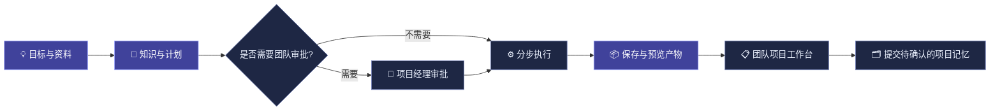

<a id="top"></a>
<div align="center">
  

  <br />

  <a href="./README.md"></a>
  <a href="./README_EN.md"></a>

  <br /><br />

  
  
  
  
  
  

  <h3>从想法，到真正可交付的结果。</h3>

  <p><strong>AI Chat · Knowledge Agent · Super Tasks · Creative Tools · Team Collaboration</strong></p>

  <p>将 <strong>知识、规划、审批、执行、产物与团队记忆</strong> 串成一个完整的 AI 工作空间。</p>

  <a href="#start"></a>
  <a href="#showcase"></a>
  <a href="#architecture"></a>
</div>

> [!IMPORTANT]
> **Generation 1 · 开发预览**：对应 **2026-10-08** 的第一代代码快照。截图来自使用演示数据的本地界面验证，不代表所有外部模型完成生产联调，也不代表平台已经通过生产环境认证。

## 📖 文档导航

[🚀 快速开始](#start) · [✨ 产品亮点](#highlights) · [🧩 核心功能](#features) · [🧰 工具箱](#tools) · [🖥️ 产品展示](#showcase) · [🏗️ 系统架构](#architecture) · [⚙️ 配置说明](#configuration) · [📋 验证与边界](#limitations) · [📚 开发文档](#documentation)

---

<a id="start"></a>
## 🚀 快速开始

以下命令在项目根目录执行，适用于 Windows PowerShell。日常本地开发不需要启动 Docker、Neo4j 或 Redis。

### 1. 准备环境

- Python **3.11 或 3.12**。现有容器使用 3.11；3.12 安装时会跳过依赖中的 DeepFilterNet / torchaudio 条件项。
- Node.js **20** 与 npm，与项目现有前端构建镜像保持一致。
- 如需云端 AI，准备至少一个已开通的模型服务账号；本地表格统计、图像裁剪不要求模型 Key。
- 本地知识检索与语音转写所需模型需预先准备缓存。

```powershell
# Python 环境与后端依赖
python -m venv .venv
.\.venv\Scripts\python.exe -m pip install -r backend/requirements.txt

# 仅在不存在时创建配置，避免覆盖已有密钥
if (-not (Test-Path -LiteralPath .env)) {
    Copy-Item -LiteralPath .env.example -Destination .env
}

# 前端依赖
Set-Location frontend
npm.cmd ci
Set-Location ..
```

编辑根目录 `.env`，将占位值改为自己的配置。未使用的服务可以留空；复制配置文件不等于 API 已可用。

### 2. 启动应用

```powershell
powershell -ExecutionPolicy Bypass -File .\run_app.ps1 -NoBrowser
```

| 服务 | 本地地址 |
| --- | --- |
| React 开发页面 | http://127.0.0.1:5173 |
| FastAPI 后端 | http://127.0.0.1:8001 |
| API 文档 | http://127.0.0.1:8001/docs |
| 健康检查 | http://127.0.0.1:8001/api/health |

脚本在后台启动服务，日志位于 `.run-logs/`。它会跳过已占用的 8001 / 5173 端口；修改后端代码或 `.env` 后应确认旧服务已正常重启，避免仍然使用旧进程。

也可以在两个终端分别运行，通过 `Ctrl+C` 停止：

```powershell
# 终端 A：项目根目录
.\.venv\Scripts\python.exe -m uvicorn backend.app:app --reload --port 8001
```

```powershell
# 终端 B：frontend 目录
npm.cmd run dev
```

### 3. 准备知识库模型（需要时）

知识检索只从本地缓存加载 Embedding / Reranker。`run_app.ps1` 会设置 Hugging Face 离线模式；缺少缓存时已有内容可能退化为关键词检索，不能据此认为向量模型正常运行。

在网络可访问 Hugging Face 的准备阶段，可单独缓存默认模型：

```powershell
$env:HF_HUB_OFFLINE = "0"
$env:TRANSFORMERS_OFFLINE = "0"
.\.venv\Scripts\python.exe -c "from sentence_transformers import SentenceTransformer, CrossEncoder; SentenceTransformer('BAAI/bge-small-zh-v1.5'); CrossEncoder('BAAI/bge-reranker-base')"
```

缓存准备与后端启动应使用同一账户、同一 `HF_HOME`。若配置其他模型名，应替换示例；也可使用预下载的本地模型目录。不要在每次问答中重复联网下载。

### 4. 生产构建

```powershell
Set-Location frontend
npm.cmd run build
Set-Location ..
```

输出位于 `frontend/dist/`。重新启动 FastAPI 后可通过 8001 端口访问构建页面；后端已有前端路由回退，未知 `/api/*` 接口仍正常返回 404。

正式部署还需 HTTPS、密钥管理、持久化、访问控制与备份，参见 [部署说明](DEPLOYMENT.md)。本次 README 编写与验证没有运行 Docker。


---

<a id="highlights"></a>
## ✨ 产品亮点 · One workspace. One connected workflow.

<p align="center">
  
</p>

<table>
<tr>
<td width="50%" valign="top">
<h3>🧠 与知识对话</h3>
<p>支持 PDF / DOCX / TXT / Markdown 导入、向量与关键词混合检索、语义重排和证据引用；可选连接知识图谱，让回答有据可查。</p>
</td>
<td width="50%" valign="top">
<h3>⚡ 从目标到交付</h3>
<p>超级任务支持目标拆解、步骤执行、预算控制、可选团队审批、暂停 / 重试，并保存可预览和下载的 HTML / JSON 产物。</p>
</td>
</tr>
<tr>
<td valign="top">
<h3>🎨 六种创作与分析工具</h3>
<p>AI 视频、图像裁剪、数据分析、数据标注、AI 语音和 Agent 工作流，把不同任务集中在一处完成。</p>
</td>
<td valign="top">
<h3>🤝 团队协作与可追溯记忆</h3>
<p>群聊、频道、项目看板、甘特图、AI 交付和团队决策记忆协同工作；规则须经人工确认，按成员权限隔离。</p>
</td>
</tr>
</table>

### 从聊天到执行，保持上下文不断线



> 这是团队任务的典型使用路径：审批是可选步骤，记忆不会从普通聊天自动写入或自动生效。


<a id="features"></a>
## 🧩 核心模块

| 模块 | 能力概览 |
| :-- | :-- |
| **⚡ 超级任务** | 目标拆解、步骤执行、可选团队审批、调用与 Token 预算、暂停恢复、失败重试、保存结果以及 HTML / JSON 产物预览和下载 |
| **💬 通用聊天** | 多模型切换、流式回答、会话管理、附件、Prompt Skill、本地模型入口 |
| **📚 知识库 Agent** | 文档导入、切片、向量与关键词混合检索、语义重排、证据引用、可选知识图谱补充 |
| **🌐 交流与协作** | 群聊、文字频道、成员与角色、AI 参与、语音大厅、项目工作台、任务看板、甘特图、Agent 交付 |
| **👤 好友与私信** | 用户搜索、好友申请及处理、好友列表、私信窗口、表情 / 表情包、未读与拉黑管理 |
| **🗂️ 团队项目记忆** | 人工提出并确认规则、纠正 / 撤销、历史修订、来源引用、群成员权限隔离 |


<a id="tools"></a>
## 🧰 六大工具 · Six tools. Countless ways to build.

| 工具 | 能做什么 | 配置要求 / 当前范围 |
| :-- | :-- | :-- |
| 🎬 **AI 视频** | 文本 / 参考图驱动的 Seedance 视频生成，任务状态与作品展示 | 需要已开通模型的火山方舟账号与后端 API Key |
| 🖼️ **图像裁剪** | 本地图片或 Qwen 生成图片的裁剪、比例选择、旋转、翻转、缩放与导出 | 本地编辑不调用模型；图片生成需 Qwen 配置 |
| 📊 **数据分析** | 全量筛选联动、BI 图表、字段画像、质量规则、清洗版本、多表关联、对话追问、CSV / PDF 导出 | 默认本地统计处理，AI 解读可选 |
| 🏷️ **数据标注** | 单图 / 批量 / ZIP 导入、目标检测预标注、置信度筛选、纠错、JSON / YOLO 导出 | 默认 `hustvl/yolos-tiny`；不等于已集成 YOLO 训练框架 |
| 🎙️ **AI 语音** | 自由对话、面试练习、情感陪伴；Aria / Omni、音色、音量、通话内容与数字人 | 依赖 Agora / Qwen Omni，须授权麦克风 |
| 🕸️ **Agent 工作流** | 拖拽画布、节点连接、配置和保存、运行记录、超级任务事件触发 | 复用现有模型、知识检索与内置文本工具；不是完整 Dify 替代品 |

<details>
<summary><b>🪄 关于 UI 与国际化</b></summary>
<br />
主界面使用分组侧边栏，支持收起、图标名称提示、独立滚动的最近对话与账户入口。主要页面提供中英文界面、蓝白 / 黑白主题和响应式布局；用户输入、模型回答和第三方错误原文不等同于界面翻译。
</details>

---

<a id="showcase"></a>
## 🖥️ 产品展示 · Product showcase

> 所见即为本地界面验证截图（演示数据），并非产品效果图。以下预览沿用原 README 的图片链接；仓库内的对应截图目录为 `docs/images/gen1/`。

### 01 / Super Tasks — 结果不止停留在聊天里

执行过程、已保存 HTML 报告、JSON 数据与可下载产物整合到工作空间；交付后可以回到团队项目工作台继续流转。

<p align="center"><a href="https://github.com/user-attachments/assets/96c8e36b-77d6-4b29-ba9c-c85da43416f3"></a></p>

<p align="center"><sub>演示数据生成的 HTML 报告；“本地技术校验通过”不等于全部业务结论已经人工验收。</sub></p>

<table>
<tr>
<td width="50%" valign="top">

<h3>02 / Data Workspace</h3>
<a href="https://github.com/user-attachments/assets/03b70333-ab12-4e5d-982f-46727cb8ad4d"></a>
<p><strong>真正联动的 BI 工作台</strong>：筛选同步更新指标、图表、字段画像、明细和 CSV 导出；质量检查、清洗、关联与追问共享数据版本。截图示例为 <strong>120 → 21 行</strong>。</p>
</td>
<td width="50%" valign="top">

<h3>03 / Project Memory</h3>
<a href="https://github.com/user-attachments/assets/6cff241f-3295-44a6-b3a0-b02ec8aa8eb7"></a>
<p><strong>先确认，再引用</strong>：团队决策与规则经过项目经理 / 管理员审核后才可引用；修订、撤销、来源与历史版本均可追溯。</p>
</td>
</tr>
<tr>
<td valign="top">

<h3>04 / Workflow Automation</h3>
<a href="https://github.com/user-attachments/assets/7bfd7078-7349-45ff-952d-4648cb1490dd"></a>
<p><strong>让事件自动启动流程</strong>：支持由超级任务的获批、交付和失败事件触发已保存工作流；查看节点进度、输入输出、耗时、错误并进行停止和重试。</p>
</td>
<td valign="top">

<h3>05 / AI Voice</h3>
<a href="https://github.com/user-attachments/assets/3318f7dc-d55e-4bc7-a0a2-c57cdc2797ee"></a>
<p><strong>从对话场景到实时通话</strong>：选择自由对话、面试练习或情感陪伴，按需配置 Aria / Omni 体验与音色。</p>
</td>
</tr>
</table>

<details>
<summary><b>🎧 展开查看更多实时语音界面</b></summary>
<br />
<p align="center">
  
  
</p>

本地展示的通话状态不是供应商实时性能承诺。数字人嘴型依据音频强度驱动，不是音素级精准口型合成。
</details>

---

<a id="architecture"></a>
## 🏗️ 系统架构


> 架构示意用于解释模块职责，不表示所有外部服务默认开启；可选服务需独立配置。

| 层级 | 当前技术与职责 |
| --- | --- |
| 界面 | React 18、Vite 6、Tailwind CSS、HeroUI、Framer Motion、Lucide；ECharts 报告、PixiJS / Live2D 数字人、Agora RTC |
| API / 实时通信 | FastAPI、Uvicorn、HTTPX；流式 HTTP、群聊 WebSocket、供应商实时语音连接 |
| 模型与编排 | LangChain Core / OpenAI 适配、LangGraph 与现有任务 / 工作流运行时；Qwen、DeepSeek / OpenAI 兼容服务、Ollama |
| 知识检索 | 自行封装切片、Sentence Transformers、ChromaDB、BM25 / RRF 与重排；可选 Neo4j |
| 本地计算 | 确定性读取、统计、筛选、质量检查、清洗和关联，不使用模型编造指标 |
| 持久化 | SQLite 保存用户、会话、项目、任务、产物、分析版本与记忆；Chroma 保存向量；Redis 可选 |

调用链：浏览器 → FastAPI → 业务模块 → 本地计算或外部模型 → 保存状态 / 产物 → 页面与团队工作台。

```text
Langchain_chatbot/
├── backend/
│   ├── app.py                   # ASGI 启动入口
│   ├── api/                     # 应用装配与业务路由
│   ├── agents/                  # 知识、金融分析、语音、视觉等能力
│   ├── core/                    # 认证与共享运行时
│   ├── infrastructure/          # 数据库、仓储、缓存与持久化
│   ├── schemas/                 # 接口数据结构
│   └── requirements.txt
├── frontend/
│   ├── src/components/          # 页面与组件
│   ├── src/features/            # 功能模块
│   ├── src/hooks/               # 业务状态与交互逻辑
│   ├── src/services/            # API 与流式协议
│   └── src/styles/              # 主题与响应式样式
├── tests/                       # 单元、评测与浏览器测试
├── docs/                        # 设计、阶段说明与配图
├── scripts/                     # 运维与辅助脚本
├── k8s/                         # 可选部署资料
├── .env.example                 # 配置模板
├── run_app.ps1                  # Windows 本地启动
└── DEPLOYMENT.md                # 部署说明
```

默认数据包括 `chat_history.db`、`chroma_data/`、`uploads/`。更改 `APP_DATA_DIR` 前检查各模块路径并备份，不要把删除这些目录当成普通重启。


<a id="configuration"></a>
## ⚙️ 配置说明

根目录 [`.env.example`](.env.example) 是配置入口，下表不展示真实密钥。

| 功能 | 主要配置项 | 说明 |
| --- | --- | --- |
| OpenAI 兼容聊天 | `OPENAI_API_KEY`、`OPENAI_BASE_URL`、`OPENAI_MODEL` | 可对接兼容服务，例如 DeepSeek；地址、Key 与模型名必须匹配 |
| Qwen 聊天 / 多模态 | `QWEN_API_KEY`、`QWEN_BASE_URL`、`QWEN_MODEL`、`QWEN3_7_MODEL` | 可用性以账号实际开通情况为准 |
| 本地模型 | `OLLAMA_BASE_URL`、`OLLAMA_MODEL` | 另行运行 Ollama 并准备模型 |
| 知识检索 | `EMBEDDING_MODEL`、`RERANKER_MODEL`、`RAG_*` | 本地缓存、检索策略与生成限制 |
| 可选图谱 | `NEO4J_URI`、`NEO4J_USERNAME`、`NEO4J_PASSWORD`、`NEO4J_DATABASE` | 受超时与降级策略约束，不是所有工具的必需服务 |
| 可选缓存 | `REDIS_URL` | 实时状态 / 缓存路径；未部署时使用现有本地回退 |
| 视频生成 | `SEEDANCE_API_KEY`、`SEEDANCE_BASE_URL`、`SEEDANCE_MODEL` | Key 仅放后端；模型或接入点必须已获授权 |
| 图片生成 | `QWEN_API_KEY`；可选 `QWEN_IMAGE_MODEL`、`QWEN_IMAGE_API_URL` | 独立的图片生成接口，不等同于聊天模型 |
| 预标注 | `HF_TOKEN`、`HF_OBJECT_DETECTION_MODEL`、`HF_INFERENCE_MODE` | `auto` 优先远程 API，无 Token 时尝试本地加载 |
| Omni 实时语音 | `QWEN_REALTIME_API_KEY`、`QWEN_REALTIME_URL`、`QWEN_REALTIME_MODEL`、`QWEN_REALTIME_VOICE` | 原生实时语音链路 |
| Aria / Agora | `AGORA_APP_ID`、`AGORA_CUSTOMER_ID`、`AGORA_CUSTOMER_SECRET`、RTC Token / UID、`AGORA_LLM_*`、`AGORA_TTS_*` | 云端回调需要 HTTPS；频道、UID 与 Token 必须匹配 |
| 本地转写 | `WHISPER_MODEL`、`WHISPER_MODEL_DIR`、`WHISPER_DEVICE` | 录音转文字，与原生实时语音不同 |
| 数据存储 | `APP_DATA_DIR` | 默认项目根目录；SQLite、Chroma 与上传内容需备份 |
| 响应速度 | `MODEL_FAST_MODE`、`MODEL_*TIMEOUT*`、`CHAT_RESPONSE_DEADLINE_SECONDS`、`GROUP_AI_DEADLINE_SECONDS` | 连接复用、快速模式、超时与上下文长度策略 |

部分可选项由代码提供默认值，不一定都列在配置模板中。不要提交 `.env`、RTC Token 或真实私密数据；开发示例中的数据库口令不能用于公开部署。


## 🔄 使用流程

### 个人使用

1. 注册 / 登录后进入工作空间，从侧边栏选择功能。
2. 直接聊天，或在知识库 Agent 导入文件后提问；需要固定回答风格时配置 Prompt Skill。
3. 上传 CSV / XLSX：先筛选，再检查质量、清洗与关联；默认无需调用模型。
4. 使用创作、标注或语音工具；外部服务未配置时先完成配置。
5. 多步骤需求创建超级任务，查看执行过程、已保存结果与产物。

### 团队交付闭环

1. **提出需求：** 群聊中沟通目标、约束和交付格式，建立关联的超级任务。
2. **检查计划：** 查看拆解步骤、输入、负责人信息和预算。
3. **可选审批：** 需要授权时选择群聊，由项目经理确认；个人任务不强制审批。
4. **执行反馈：** 按步骤查看状态；缺少输入、预算不足或失败时使用对应处理入口。
5. **回到团队：** 团队任务完成后发布交付摘要，在项目工作台查看 Agent 交付，看板继续跟踪工作。
6. **沉淀记忆：** 手动提出确认过的决策 / 规则，由项目经理或管理员确认，不把普通聊天自动变成长期规则。

任务步骤数量取决于实际计划，进度依据执行记录。登录页六阶段动画仅为产品演示，不代表后台固定执行六个任务。

### 团队记忆的权限原则

- 只有当前群成员能读取本群记忆，个人任务不会自动读取群记忆。
- 普通成员不能确认规则或修改他人已生效的记忆。
- AI 引用记录具体版本，可查看来源；撤销后不再供新回答引用。
- 纠正需重新确认，旧版本保留；历史回答与已完成交付不会被悄悄改写。
- 检索不额外调用模型，但引用内容仍消耗正常输入 Token。

详见 [团队项目记忆](docs/team-project-memory.md)。


<a id="limitations"></a>
## 📋 验证与边界

### 本地回归方式

依赖已安装的开发环境可运行以下确定性测试，覆盖项目记忆、群聊、任务、全量分析与响应速度，不需要 Docker：

```powershell
.\.venv\Scripts\python.exe -m unittest tests.unit.test_project_memory tests.unit.test_group_chat tests.unit.test_super_task_runtime tests.unit.test_analysis_workspace tests.unit.test_response_speed
```

前端协议 / 产物预览测试与构建：

```powershell
Set-Location frontend
node --test src/services/chatStream.test.mjs src/features/super-task/artifactPreview.test.mjs
npm.cmd run build
Set-Location ..
```

此前阶段性验证包含临时 SQLite、模型测试替身、真实表格读写及 1440 / 768 / 390px 浏览器检查，范围记录在各模块文档中。本次 README 更新仅核对代码、配图与链接，未重新执行完整应用测试，也未调用付费模型。

### 第一代的明确边界

- **超级任务：** 表格分析已接真实本地工具并生成报告；视频 / 工作流步骤仍生成简报或设计文本，不自动创建视频或可执行工作流。独立视频工具、工作流编辑器是另一个真实功能入口。
- **分析上限：** BI 单文件 ≤ 10 MB、50,000 条非空数据行、100 列、1,000,000 单元格，超限拒绝。超级任务描述性报告目前最多读取第一个工作表的 5,000 行、100 列，达到上限提示采样。
- **BI 范围：** 不是任意自然语言 SQL、预测、因果分析或完整 Power BI。当前未安装 DuckDB、Great Expectations、Metabase，它们是设计参考。
- **批量标注：** ZIP ≤ 100 MB、最多 100 张图片，图片解压总量 ≤ 50 MB、单图 ≤ 10 MB。预标注仍需人工复核，不承诺准确率。
- **成本：** 估算 / 预留 Token 与实际账单不同。停止不能保证撤回已发出的模型请求或免除费用。
- **工作流恢复：** 自动化保留版本与历史、可恢复队列；崩溃可能重复中断节点的模型调用。手动重试从原版本开头执行，不是通用断点续跑或严格一次保证。
- **语音：** 麦克风通常要求 HTTPS 或 localhost；外部语音服务需独立联调。数字人素材需确认授权，不宣称已实现任意网页 / 桌面实时操作。
- **外部服务：** “已配置”不等于“已连通”或“模型已获授权”；本地测试不能替代供应商环境验证，没有统一线上响应时间 SLA。
- **隐私：** 分析数据、任务产物与项目记忆有相应服务端权限检查；普通媒体另有静态资源路径，不能假设所有媒体 URL 都具有同等私密保护。公开部署前应进一步审计。
- **国际化：** 主要交互支持中英文，不自动翻译用户内容；新组件与第三方错误文案仍需持续回归。

### 常见问题

| 现象 | 优先检查 |
| --- | --- |
| 刷新出现 `Not Found` | 是否打开正确前端端口；8001 单服务模式是否已构建 `frontend/dist` 并重启 |
| 一直“待配置 API” | `.env` 位置、占位 Key、配置名以及旧后端是否重启 |
| 连接失败 / 等待过久 | 供应商地址、网络 / 代理、配额、模型权限；查看 `.run-logs/backend.err.log`，避免无限重复点击 |
| 知识库 Hugging Face 错误 | 本地缓存与 `HF_HOME` 是否一致；准备缓存并检查是否降级为关键词检索 |
| 语音大厅 / 通话失败 | 麦克风、HTTPS、RTC Token 过期、频道 / UID、Agora 回调与 Qwen Realtime 配置 |
| 旧 BI 报告不能联动 | 旧报告可能只有摘要 / 预览，需要重新上传原始文件 |

提交问题时提供复现步骤、模块、界面语言、浏览器、时间和脱敏日志，不要提供 Key、Token 或真实私密数据。


<a id="documentation"></a>
## 📚 开发文档

| 文档 | 内容 |
| --- | --- |
| [部署说明](DEPLOYMENT.md) | 环境、构建与部署 |
| [概要设计](docs/design/概要设计说明书.md) / [详细设计 PDF](docs/design/arrogance.ai-详细设计说明书.pdf) | 产品与系统设计；历史描述结合当前代码阅读 |
| [代码结构](docs/architecture/CODE_STRUCTURE.md) / [任务生命周期](docs/architecture/TASK_LIFECYCLE_DESIGN.md) | 模块组织与状态设计 |
| [阶段开发记录](docs/development-stages.md) | 阶段演进 |
| [Agent 真实工具交付](docs/agent-real-delivery.md) | 输入、预算、审批、报告与验收边界 |
| [超级任务结果展示](docs/super-task-results.md) | HTML / JSON 预览和下载 |
| [团队项目记忆](docs/team-project-memory.md) | 确认、版本、来源与权限 |
| [BI 数据工作台](docs/data-analysis-workspace.md) | 全量联动、质量、清洗、关联和追问 |
| [工作流自动化](docs/workflow-automation.md) | 事件、队列、执行与恢复 |
| [响应速度策略](docs/response-speed.md) | 流式、连接复用、降级与超时 |
| [语音大厅稳定性](docs/voice-lobby-reliability.md) | 群聊语音故障处理 |
| [实时语音手册](docs/interview/声网实时语音Agent-详细设计与面试手册.md) / [Live2D 接入](docs/LIVE2D_AVATAR.md) | 语音架构与数字人 |
| [Ollama 本地模型](docs/OLLAMA_LOCAL_MODEL.md) | 本地运行 |
| [RAG 评测 PDF](docs/interview/arrogance.ai-RAG质检评测面试手册.pdf) | 检索与质检 |
| [Kubernetes](k8s/README.md) / [K8s 命令速查](docs/kubernetes/K8s常用命令速查.md) | 可选部署资料 |
| [配图说明](docs/images/gen1/README.md) | 截图来源与演示数据说明 |
| [早期 README 存档](docs/archive/README-knowledge-base.md) | 旧版本记录，功能与启动以本文为准 |


## 🧭 后续方向

优先完善真实工具交付、业务验收与可观测性，再扩展跨工具编排。更大规模数据计算、企业权限策略和更精细的语音交互属于后续方向，不代表已上线。


## 🔐 授权与安全

当前项目根目录未提供独立 `LICENSE`，不能默认按 MIT 等开源许可使用。对外分发或商用前应由所有者明确许可，并核对 SDK、数字人、字体、视频和其他素材授权。


---

<div align="center">

  <strong>arrogance.ai</strong> · Think together. Build with context.

  <p><sub>Generation 01 · React · FastAPI · AI Agents · Team Collaboration</sub></p>
  <a href="./README.md"></a>
  <a href="./README_EN.md"></a>
  <p><a href="#top">↑ 返回顶部</a></p>
</div>
