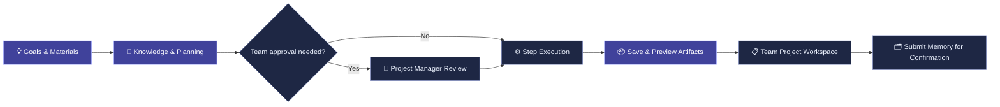

<a id="top"></a>
<div align="center">
  

  <br />

  <a href="./README.md"></a>
  <a href="./README_EN.md"></a>

  <br /><br />

  
  
  
  
  
  

  <h3>From ideas to real deliverables.</h3>

  <p><strong>AI Chat · Knowledge Agent · Super Tasks · Creative Tools · Team Collaboration</strong></p>

  <p>A connected AI workspace for <strong>knowledge, planning, approvals, execution, artifacts, and team memory</strong>.</p>

  <a href="#start"></a>
  <a href="#showcase"></a>
  <a href="#architecture"></a>
</div>

> [!IMPORTANT]
> **Generation 1 · Development Preview:** This README describes the first-generation code snapshot dated **October 8, 2026**. Screenshots come from local UI validation using demonstration data. They do not prove that all external AI integrations have been production-tested or that the platform has received production certification.

## 📖 Documentation

[🚀 Quick Start](#start) · [✨ Highlights](#highlights) · [🧩 Core Features](#features) · [🧰 Six Tools](#tools) · [🖥️ Showcase](#showcase) · [🏗️ Architecture](#architecture) · [⚙️ Configuration](#configuration) · [📋 Testing & Limits](#limitations) · [📚 Developer Docs](#documentation)

---

<a id="start"></a>
## 🚀 Quick Start

Run the following commands in **Windows PowerShell** from the project root. Docker, Neo4j, and Redis are **not required** for day-to-day local development.

### 1. Requirements

- **Python 3.11 or 3.12**. Current containers use Python 3.11. With Python 3.12, conditional DeepFilterNet / torchaudio dependencies are skipped.
- **Node.js 20** and npm, matching the project's frontend build image.
- At least one authorized AI service account if you want cloud AI. Local spreadsheet statistics and image cropping do not require a model API Key.
- Pre-cached models for local knowledge retrieval and speech transcription, where needed.

```powershell
# Create Python environment and install backend dependencies
python -m venv .venv
.\.venv\Scripts\python.exe -m pip install -r backend/requirements.txt

# Create .env only if missing, so existing credentials are not overwritten
if (-not (Test-Path -LiteralPath .env)) {
    Copy-Item -LiteralPath .env.example -Destination .env
}

# Install frontend dependencies
Set-Location frontend
npm.cmd ci
Set-Location ..
```

Edit the `.env` file at the repository root and replace placeholders with your own configuration. Unused services may be left unconfigured. Copying the configuration template does not establish API connectivity.

### 2. Launch the App

```powershell
powershell -ExecutionPolicy Bypass -File .\run_app.ps1 -NoBrowser
```

| Service | Local URL |
| --- | --- |
| React development UI | http://127.0.0.1:5173 |
| FastAPI backend | http://127.0.0.1:8001 |
| API documentation | http://127.0.0.1:8001/docs |
| Health check | http://127.0.0.1:8001/api/health |

The script starts services in the background and places logs in `.run-logs/`. It skips ports 8001 / 5173 if already occupied; after changing backend code or `.env`, ensure old processes have been restarted instead of accidentally continuing to use them.

Alternatively, start each service in its own terminal. Use `Ctrl+C` to stop it.

```powershell
# Terminal A: project root
.\.venv\Scripts\python.exe -m uvicorn backend.app:app --reload --port 8001
```

```powershell
# Terminal B: frontend directory
npm.cmd run dev
```

### 3. Prepare Knowledge Models (When Needed)

The retrieval system loads Embedding and Reranker models from a **local cache only**. `run_app.ps1` sets Hugging Face offline mode. If the models are missing, existing content may fall back to keyword search; do not confuse that fallback with a properly running vector model.

When you have network access to Hugging Face, cache the default models separately:

```powershell
$env:HF_HUB_OFFLINE = "0"
$env:TRANSFORMERS_OFFLINE = "0"
.\.venv\Scripts\python.exe -c "from sentence_transformers import SentenceTransformer, CrossEncoder; SentenceTransformer('BAAI/bge-small-zh-v1.5'); CrossEncoder('BAAI/bge-reranker-base')"
```

Model preparation and backend startup should use the same account and `HF_HOME`. Replace the names if you configured other models; pre-downloaded local model directories also work. Do not download models anew on every question.

### 4. Build for Production

```powershell
Set-Location frontend
npm.cmd run build
Set-Location ..
```

The output is written to `frontend/dist/`. Restart FastAPI to serve the built frontend through port 8001. The backend has a frontend routing fallback, and unknown `/api/*` endpoints still return HTTP 404.

Real deployments also require HTTPS, secret management, persistence, access control, and backups. See [Deployment Documentation](DEPLOYMENT.md). Docker was not run during the original README preparation and verification.

---

<a id="highlights"></a>
## ✨ Highlights · One workspace. One connected workflow.

<p align="center">
  
</p>

<table>
<tr>
<td width="50%" valign="top">
<h3>🧠 Talk to your knowledge</h3>
<p>Import PDF, DOCX, TXT, or Markdown files. Combine vector and keyword search, semantic reranking, evidence citations, and optional knowledge graph enrichment.</p>
</td>
<td width="50%" valign="top">
<h3>⚡ From goals to deliverables</h3>
<p>Break goals into steps, manage budgets, optionally request team approvals, pause and retry execution, and save previewable or downloadable HTML / JSON artifacts.</p>
</td>
</tr>
<tr>
<td valign="top">
<h3>🎨 Six creative and analytical tools</h3>
<p>Use AI video, image cropping, data analytics, data annotation, AI voice, and Agent workflows in one application.</p>
</td>
<td valign="top">
<h3>🤝 Collaboration with traceable memory</h3>
<p>Group chat, channels, project boards, Gantt charts, Agent handoffs, and team decision memory work together. Rules must be manually confirmed and are protected by membership permissions.</p>
</td>
</tr>
</table>

### From chat to execution, with context carried forward



> This is a typical team-task path. Approvals are optional, and ordinary chat messages do not automatically become persistent project memory.

<a id="features"></a>
## 🧩 Core Modules

| Module | Capabilities |
| :-- | :-- |
| **⚡ Super Tasks** | Goal decomposition, step execution, optional team approval, API call and Token budgets, pause/resume, failure retries, saved results, and HTML / JSON artifact preview and download |
| **💬 General Chat** | Multi-model switching, streaming answers, session management, attachments, Prompt Skills, and local-model access |
| **📚 Knowledge Agent** | Document imports and chunking; hybrid vector and keyword retrieval, reranking, evidence citations, and optional graph enrichment |
| **🌐 Communication & Collaboration** | Group chat, channels, members and roles, AI participation, voice lobby, project workspace, task board, Gantt chart, and Agent handoffs |
| **👤 Friends & Direct Messaging** | User search, friend requests and handling, friend list, private messages, emoji and stickers, unread status, and blocking controls |
| **🗂️ Team Project Memory** | Manually proposed and approved decisions and rules, corrections, revocations, revision history, source citations, and membership-based isolation |

<a id="tools"></a>
## 🧰 Six tools. Countless ways to build.

| Tool | Capabilities | Requirements / Current Scope |
| :-- | :-- | :-- |
| 🎬 **AI Video** | Seedance text- / reference-image-driven video generation, task status, and works gallery | Requires a Volcano Ark account authorized for the corresponding model and a backend API Key |
| 🖼️ **Image Cropping** | Cropping, aspect ratio presets, rotation, flipping, scaling, and export for local or Qwen-generated images | Local edits do not call a model; generation requires Qwen configuration |
| 📊 **Data Analytics** | Synchronized full-data filters, BI charts, field profiling, quality rules, cleaned versions, joins, follow-up questions, and CSV / PDF exports | Local deterministic statistics and processing by default; optional AI interpretation |
| 🏷️ **Data Annotation** | Single, batch, and ZIP imports, object-detection pre-annotation, confidence filtering, class correction, false-label removal, and JSON / YOLO export | Default `hustvl/yolos-tiny`; not an integrated YOLO model-training framework |
| 🎙️ **AI Voice** | Open chat, interview practice, emotional companionship, Aria / Omni experiences, voice and volume options, call content, and digital avatars | Depends on Agora / Qwen Omni; browser microphone permission required |
| 🕸️ **Agent Workflows** | Drag-and-drop canvas, connected nodes, configuration, save and dashboard, execution history, and Super Task event triggers | Reuses existing models, knowledge retrieval, and built-in text tools; not a complete Dify substitute |

<details>
<summary><b>🪄 UI and Internationalization</b></summary>
<br />
The grouped sidebar supports collapsing, icon-label tooltips, independently scrolling recent conversations, and account access. Primary pages include Chinese / English UI, blue-white / black-white themes, and responsive layouts. User input, model-generated content, and raw third-party errors are not automatically translated.
</details>

---

<a id="showcase"></a>
## 🖥️ Product Showcase

> Screenshots are from the original README's local UI verification using demonstration data, not design mockups. The corresponding image folder in the repository is `docs/images/gen1/`.

### 01 / Super Tasks — Results beyond a chat message

Execution progress, saved HTML reports, JSON data, and downloads remain together in the workspace. Team deliverables can flow back into the project workbench.

<p align="center"><a href="https://github.com/user-attachments/assets/96c8e36b-77d6-4b29-ba9c-c85da43416f3"></a></p>

<p align="center"><sub>Saved HTML report generated from demonstration data. Local technical validation does not mean all business conclusions have passed manual review.</sub></p>

<table>
<tr>
<td width="50%" valign="top">
<h3>02 / Data Workspace</h3>
<a href="https://github.com/user-attachments/assets/03b70333-ab12-4e5d-982f-46727cb8ad4d"></a>
<p><strong>Truly synchronized BI analytics.</strong> Filters update metrics, charts, field profiles, paginated detail tables, and CSV exports together. Quality rules, cleaning, joins, and follow-up questions operate on consistent data versions. Screenshot example: <strong>120 → 21 rows</strong>.</p>
</td>
<td width="50%" valign="top">
<h3>03 / Project Memory</h3>
<a href="https://github.com/user-attachments/assets/6cff241f-3295-44a6-b3a0-b02ec8aa8eb7"></a>
<p><strong>Confirm first, reference later.</strong> Decisions and rules are available to AI only after a project manager or admin approves them. Corrections, revocations, citations, and revision history remain traceable.</p>
</td>
</tr>
<tr>
<td valign="top">
<h3>04 / Workflow Automation</h3>
<a href="https://github.com/user-attachments/assets/7bfd7078-7349-45ff-952d-4648cb1490dd"></a>
<p><strong>Start workflows from events.</strong> Saved workflows can be triggered by Super Task approval, delivery, or failure. Inspect node progress, inputs, outputs, elapsed time, and errors; stop or retry as needed.</p>
</td>
<td valign="top">
<h3>05 / AI Voice</h3>
<a href="https://github.com/user-attachments/assets/3318f7dc-d55e-4bc7-a0a2-c57cdc2797ee"></a>
<p><strong>From a scenario to a live conversation.</strong> Choose open chat, interview practice, or emotional companionship, then configure Aria / Omni and voice options.</p>
</td>
</tr>
</table>

<details>
<summary><b>🎧 More Real-time Voice Screens</b></summary>
<br />
<p align="center">
  
  
</p>
Local UI call states are not provider performance guarantees. Avatar mouth movement is driven by audio intensity, not accurate phoneme-level lip synthesis.
</details>

---

<a id="architecture"></a>
## 🏗️ System Architecture


> This architectural overview explains module responsibilities; it does not imply all external services are active by default. Optional integrations require separate configuration. (The original architecture illustration contains Chinese labels.)

| Layer | Technologies & Responsibilities |
| --- | --- |
| UI | React 18, Vite 6, Tailwind CSS, HeroUI, Framer Motion, Lucide; ECharts, PixiJS / Live2D avatars, Agora RTC |
| API / Real-time Communication | FastAPI, Uvicorn, HTTPX; streaming HTTP, group-chat WebSockets, and provider real-time voice connections |
| Models & Orchestration | LangChain Core / OpenAI adapters, LangGraph, task / workflow runtimes; Qwen, DeepSeek / OpenAI-compatible endpoints, Ollama |
| Knowledge Retrieval | Custom chunking, Sentence Transformers, ChromaDB, BM25 / RRF, reranking, optional Neo4j |
| Local Computation | Deterministic data loading, statistics, filtering, quality checks, cleaning, and joins without fabricated model-generated metrics |
| Persistence | SQLite for users, conversations, projects, tasks, artifacts, analysis versions, and memory; Chroma for vectors; optional Redis |

**Request path:** Browser → FastAPI → Business Module → Local Computation / External Model → Saved State & Artifacts → UI / Team Workspace.

```text
Langchain_chatbot/
├── backend/
│   ├── app.py                   # ASGI application entry point
│   ├── api/                     # Application assembly and business routes
│   ├── agents/                  # Knowledge, finance, voice, and vision capabilities
│   ├── core/                    # Authentication and shared runtime
│   ├── infrastructure/          # Databases, repositories, caches, persistence
│   ├── schemas/                 # API schemas
│   └── requirements.txt
├── frontend/
│   ├── src/components/          # Pages and components
│   ├── src/features/            # Feature modules
│   ├── src/hooks/               # State and interaction hooks
│   ├── src/services/            # API and streaming protocols
│   └── src/styles/              # Themes and responsive styles
├── tests/                       # Unit, evaluation, and browser tests
├── docs/                        # Design documents, development notes, images
├── scripts/                     # Operations and helper scripts
├── k8s/                         # Optional deployment resources
├── .env.example                 # Configuration template
├── run_app.ps1                  # Windows startup script
└── DEPLOYMENT.md                # Deployment instructions
```

Default data locations include `chat_history.db`, `chroma_data/`, and `uploads/`. Back up data and check module paths before modifying `APP_DATA_DIR`. Do not delete these directories as part of an ordinary restart.

<a id="configuration"></a>
## ⚙️ Configuration

The root [`.env.example`](.env.example) is the configuration entry point. The table does not expose real credentials.

| Feature | Main Keys | Notes |
| --- | --- | --- |
| OpenAI-compatible chat | `OPENAI_API_KEY`, `OPENAI_BASE_URL`, `OPENAI_MODEL` | Can connect to compatible services such as DeepSeek; endpoint, Key, and model must match |
| Qwen / Multimodal | `QWEN_API_KEY`, `QWEN_BASE_URL`, `QWEN_MODEL`, `QWEN3_7_MODEL` | Subject to your account's actual model access |
| Local models | `OLLAMA_BASE_URL`, `OLLAMA_MODEL` | Run Ollama separately and provision the model |
| Knowledge retrieval | `EMBEDDING_MODEL`, `RERANKER_MODEL`, `RAG_*` | Local cache, retrieval strategies, and generation limits |
| Optional graph | `NEO4J_URI`, `NEO4J_USERNAME`, `NEO4J_PASSWORD`, `NEO4J_DATABASE` | Uses timeout and degradation policies; not required for every tool |
| Optional cache | `REDIS_URL` | Real-time state and cache; local fallback where provided |
| Video generation | `SEEDANCE_API_KEY`, `SEEDANCE_BASE_URL`, `SEEDANCE_MODEL` | Backend-only Key; access to the endpoint / model must be authorized |
| Image generation | `QWEN_API_KEY`; optional `QWEN_IMAGE_MODEL`, `QWEN_IMAGE_API_URL` | Separate image endpoint, not the chat model |
| Pre-annotation | `HF_TOKEN`, `HF_OBJECT_DETECTION_MODEL`, `HF_INFERENCE_MODE` | `auto` prioritizes remote API, with local loading attempted without a Token |
| Omni real-time voice | `QWEN_REALTIME_API_KEY`, `QWEN_REALTIME_URL`, `QWEN_REALTIME_MODEL`, `QWEN_REALTIME_VOICE` | Native real-time voice connection |
| Aria / Agora | `AGORA_APP_ID`, `AGORA_CUSTOMER_ID`, `AGORA_CUSTOMER_SECRET`, RTC Token / UID, `AGORA_LLM_*`, `AGORA_TTS_*` | Cloud callbacks need HTTPS; channel, UID, and Token must match |
| Local transcription | `WHISPER_MODEL`, `WHISPER_MODEL_DIR`, `WHISPER_DEVICE` | Audio-to-text transcription; distinct from native real-time voice |
| Data storage | `APP_DATA_DIR` | Defaults to project root; back up SQLite, Chroma, and uploads |
| Performance | `MODEL_FAST_MODE`, `MODEL_*TIMEOUT*`, `CHAT_RESPONSE_DEADLINE_SECONDS`, `GROUP_AI_DEADLINE_SECONDS` | Connection reuse, fast mode, timeouts, and context-size strategies |

Some optional settings have code-defined defaults and do not necessarily appear in the template. Never commit `.env`, RTC Tokens, or private data. Example development database passwords are not suitable for public deployment.

<a id="usage"></a>
## 🔄 Usage Workflows

### Personal Workspace

1. Register or log in, then choose a feature from the sidebar.
2. Chat directly, or import files into the Knowledge Agent and ask document-grounded questions. Set up Prompt Skills for fixed response styles.
3. Upload CSV / XLSX files to filter, check quality, clean, and join data; model calls are not required by default.
4. Use creation, annotation, and voice features after configuring any required external providers.
5. Create a Super Task for multi-step requirements; inspect steps, saved results, and artifacts.

### Team Delivery Loop

1. **Request:** Discuss objectives, constraints, and delivery formats in group chat, then associate a Super Task.
2. **Plan:** Review steps, required inputs, ownership, and budgets.
3. **Optional approval:** Select the team group and ask the project manager to confirm when authorization is required. Personal tasks do not require group approval.
4. **Execution feedback:** Inspect step status and use appropriate controls for missing inputs, exhausted budgets, and failures.
5. **Return to the team:** Publish a delivery summary, inspect the Agent deliverable in the project workspace, and continue tracking via the task board.
6. **Confirm memory:** Manually propose decisions and rules for project-manager or administrator confirmation. Ordinary messages do not automatically become persistent policies.

Step counts depend on the plan, and progress reflects actual execution records. The six-stage login animation is a product demonstration, not a fixed six-task backend execution sequence.

### Team Memory Permission Model

- Only current members may read the group's memory; personal tasks do not automatically receive group memory.
- Ordinary members cannot confirm rules or modify others' active memory.
- AI cites exact memory versions and sources; revocation prevents new references.
- Corrections require another confirmation, and previous revisions are preserved.
- Earlier answers and completed deliverables are not silently rewritten.
- Retrieval itself does not make an extra model call; referenced content still counts as normal input Tokens.

See [Team Project Memory](docs/team-project-memory.md).

<a id="limitations"></a>
## 📋 Verification & Limitations

### Local Regression Tests

With the development dependencies installed, these deterministic tests cover memory, group chat, tasks, full-data analytics, and response performance without Docker:

```powershell
.\.venv\Scripts\python.exe -m unittest tests.unit.test_project_memory tests.unit.test_group_chat tests.unit.test_super_task_runtime tests.unit.test_analysis_workspace tests.unit.test_response_speed
```

Frontend protocols, artifact previews, and build:

```powershell
Set-Location frontend
node --test src/services/chatStream.test.mjs src/features/super-task/artifactPreview.test.mjs
npm.cmd run build
Set-Location ..
```

Past milestone-level validation included temporary SQLite databases, mock model providers, actual spreadsheet operations, and browser tests at 1440 / 768 / 390px widths, as described in module documents. The original README update reviewed code, images, and links but did not rerun every application test or invoke paid models.

### Explicit Generation 1 Boundaries

- **Super Tasks:** Spreadsheet analysis uses real local tools and creates reports. Video / workflow steps within Super Tasks still produce briefs or design text; they do not automatically generate videos or executable workflows. Standalone video and workflow tools have separate entry points.
- **Analytics limits:** BI accepts at most 10 MB per file, 50,000 non-empty rows, 100 columns, and 1,000,000 cells; files beyond the limit are rejected. Descriptive Super Task reports currently read up to 5,000 rows and 100 columns from the first worksheet, with sampling notices.
- **BI scope:** Not unrestricted natural-language SQL, prediction, causal analysis, or a complete Power BI replacement. DuckDB, Great Expectations, and Metabase are design references rather than installed components.
- **Batch annotation:** ZIP up to 100 MB, 100 images, 50 MB total extracted image size, and 10 MB per image. Pre-annotations require review; accuracy is not guaranteed.
- **Costs:** Estimated / reserved Tokens can differ from actual provider billing. Stopping a task cannot guarantee revocation of requests already sent or reimbursement.
- **Workflow recovery:** Automations preserve versions and history with a recoverable queue. Interrupted nodes may trigger duplicate model calls after crashes. Manual retries start at the beginning of the original version, not from a universal checkpoint or exactly-once guarantee.
- **Voice:** Microphone access generally requires HTTPS or localhost; external providers need independent integration testing. Avatar assets require authorization. Arbitrary real-time browser / desktop operation is not claimed.
- **External services:** Configured does not mean reachable or authorized. Local checks do not replace provider testing, and no unified production response-time SLA is provided.
- **Privacy:** Analytics, task artifacts, and project memory have service-side permission checks, but ordinary media also has static-resource paths and may not have equivalent privacy guarantees. Audit before public deployment.
- **Localization:** Core UI supports Chinese and English. User content is not automatically translated; new components and third-party error messages need continued verification.

### Troubleshooting

| Symptom | First Things to Check |
| --- | --- |
| `Not Found` after refresh | Correct frontend port, or build `frontend/dist` and restart port-8001 single-service mode |
| Perpetual API-configuration warning | Root `.env`, placeholder Keys, variable names, and old backend processes |
| Connection failure / long wait | Provider address, network / proxy, quota, model authorization, `.run-logs/backend.err.log` |
| Hugging Face error | Correct local cache and `HF_HOME`; check whether retrieval fell back to keyword search |
| Voice lobby / call failure | Mic permission, HTTPS, RTC Token expiry, channel / UID, Agora callback, Qwen Realtime settings |
| Older BI reports do not update | They may only contain summaries or previews; reupload the original dataset |

Include reproduction steps, module, UI language, browser, time, and sanitized logs when reporting issues. Never post Keys, Tokens, or private data.

<a id="documentation"></a>
## 📚 Developer Documentation

| Document | Purpose |
| --- | --- |
| [Deployment](DEPLOYMENT.md) | Environment, builds, and deployment |
| [High-level Design](docs/design/概要设计说明书.md) / [Detailed Design PDF](docs/design/arrogance.ai-详细设计说明书.pdf) | Product / system design; interpret historical statements against current code |
| [Code Structure](docs/architecture/CODE_STRUCTURE.md) / [Task Lifecycle](docs/architecture/TASK_LIFECYCLE_DESIGN.md) | Module organization and task state model |
| [Development Stages](docs/development-stages.md) | Project evolution |
| [Agent Tool Delivery](docs/agent-real-delivery.md) | Inputs, budgets, approval, report, and acceptance limits |
| [Super Task Artifacts](docs/super-task-results.md) | HTML / JSON preview and downloads |
| [Team Project Memory](docs/team-project-memory.md) | Confirmation, versions, sources, permissions |
| [BI Data Workspace](docs/data-analysis-workspace.md) | Linked filtering, data quality, cleaning, joins, follow-ups |
| [Workflow Automation](docs/workflow-automation.md) | Events, queue, execution, and recovery |
| [Response Performance](docs/response-speed.md) | Streaming, connection pooling, fallback, timeout |
| [Voice Lobby Reliability](docs/voice-lobby-reliability.md) | Group voice failure handling |
| [Real-time Voice Handbook](docs/interview/声网实时语音Agent-详细设计与面试手册.md) / [Live2D](docs/LIVE2D_AVATAR.md) | Voice architecture and avatars |
| [Ollama Local Models](docs/OLLAMA_LOCAL_MODEL.md) | Local runtime |
| [RAG Evaluation PDF](docs/interview/arrogance.ai-RAG质检评测面试手册.pdf) | Retrieval and quality evaluation |
| [Kubernetes](k8s/README.md) / [K8s Command Reference](docs/kubernetes/K8s常用命令速查.md) | Optional deployment material |
| [Image Notes](docs/images/gen1/README.md) | Screenshot sources and demo data |
| [Legacy README](docs/archive/README-knowledge-base.md) | Early documentation; use the present README for current features and startup |

## 🧭 Roadmap

Priorities include completing real tool-based deliverables, business validation, and observability before widening cross-tool orchestration. Larger-scale data processing, enterprise permissions, and finer-grained voice interaction are future directions, not shipped features.

## 🔐 License & Security

The project root currently has no standalone `LICENSE`. Do not assume that the code is MIT-licensed or otherwise available for unrestricted open-source use. Explicit permission from the owner is required for redistribution or commercial use; check third-party SDK, avatar, font, video, and other asset licenses.

---

<div align="center">

  <strong>arrogance.ai</strong> · Think together. Build with context.

  <p><sub>Generation 01 · React · FastAPI · AI Agents · Team Collaboration</sub></p>
  <a href="./README.md"></a>
  <a href="./README_EN.md"></a>
  <p><a href="#top">↑ Back to top</a></p>
</div>
